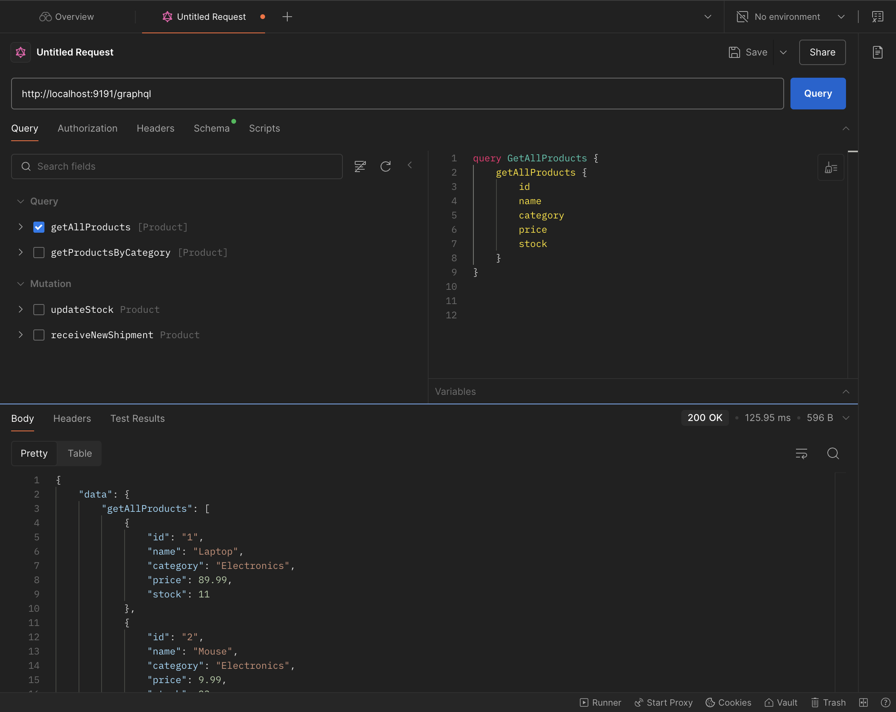
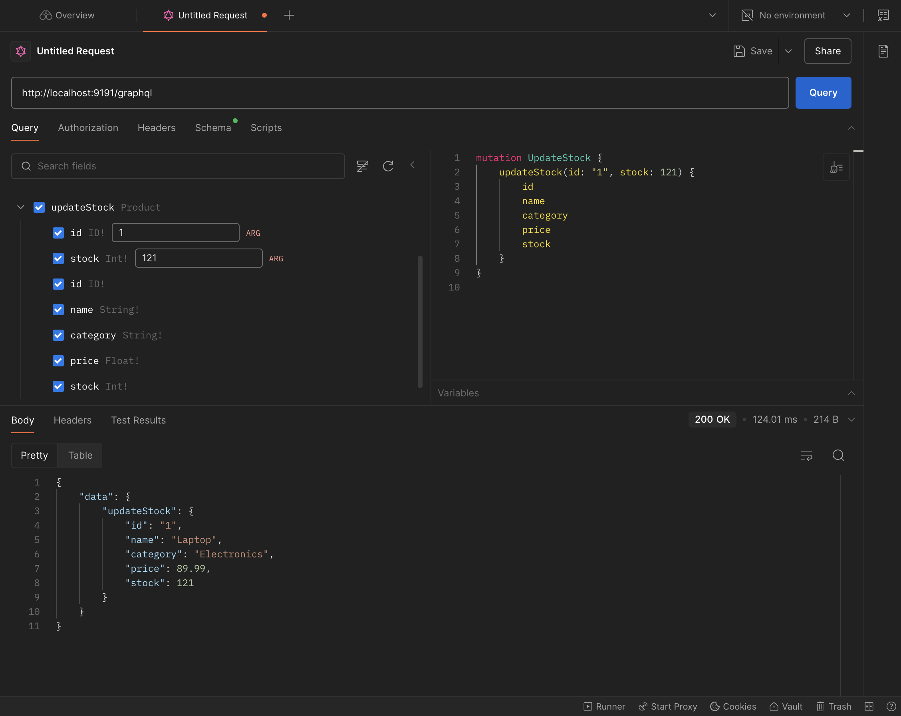
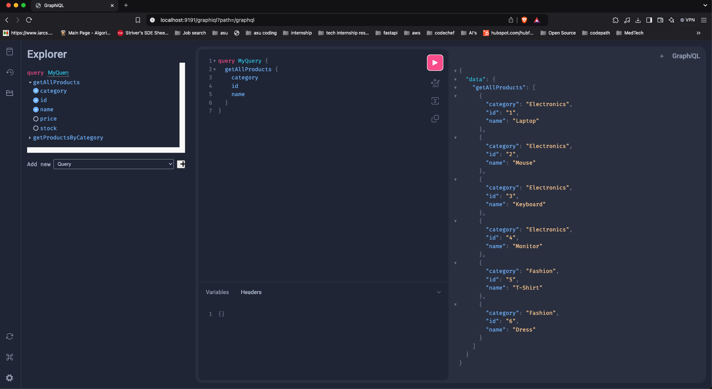

# GraphQL with Spring Boot

## Project Overview
This project demonstrates the implementation of a GraphQL API using Spring Boot. It illustrates the transition from traditional RESTful APIs to a GraphQL-based approach, showcasing how GraphQL can provide tailored responses for different clients. By defining schemas and queries, the project ensures efficient data retrieval, client-server decoupling, and streamlined CRUD operations.

## Features
- **GraphQL Query Support**: Retrieve specific fields as per client requirements.
- **GraphQL Mutation Support**: Perform create, update, and delete operations.
- **Dynamic Query Building**: Clients can request only the data they need.
- **Loose Coupling**: Reduced dependency between server and client.

## Technologies Used
- **Spring Boot**: Backend framework.
- **GraphQL**: Query language for APIs.
- **MySQL**: Database for persistent storage.
- **Postman**: API testing.

## Prerequisites
- Java Development Kit (JDK) 21
- Docker and Docker Compose
- Gradle
- Postman (optional for testing)

## Setup and Installation

1. Clone the repository:
    ```bash
    git clone https://github.com/DharaniDJ/springboot-graphql.git
    ```

2. Navigate to the project directory:
    ```bash
    cd springboot-graphql
    ```

3. Use Docker Compose to set up MySQL:
    ```yaml
    version: '3.8'
    services:
    mysql:
        image: mysql:8.0
        container_name: mysql-container
        ports:
        - "3306:3306"
        environment:
        MYSQL_ROOT_PASSWORD: password
        MYSQL_DATABASE: springboot-grapql
        volumes:
        - db_data:/var/lib/mysql
    volumes:
    db_data:

    ```

4. Run the following command to start the MySQL container:
    ```bash
    docker-compose up -d
    ```

5. Open `application.properties` and configure the database:
    ```properties
    spring.application.name=springboot-grapql
    server.port=9191

    # Database connection properties
    spring.datasource.driver-class-name=com.mysql.cj.jdbc.Driver
    spring.datasource.url=jdbc:mysql://localhost:3306/springboot-grapql
    spring.datasource.username=root
    spring.datasource.password=password

    #JPA SPECIFIC PROPERTIES
    spring.jpa.hibernate.ddl-auto=update
    spring.jpa.show-sql=true
    spring.jpa.properties.hibernate.dialect=org.hibernate.dialect.MySQL8Dialect
    spring.jpa.hibernate.naming.physical-strategy=org.hibernate.boot.model.naming.PhysicalNamingStrategyStandardImpl

    #Enabling GraphQL playground
    spring.graphql.graphiql.enabled=true
    spring.graphql.graphiql.path=/graphiql
    ```

6. Build and run the application:
    ```bash
    ./gradlew clean build
    ./gradlew bootRun
    ```

7. Access the GraphQL endpoint at:
    ```
    http://localhost:9191/graphql
    ```

## GraphQL Schema
The GraphQL schema defines the structure of queries, mutations, and types. Below is the schema used in this project:

### Schema Definition
```graphql
type Product{
    id: ID!
    name: String!
    category: String!
    price: Float!
    stock: Int!
}

type Query{
    getAllProducts: [Product]
    getProductsByCategory(category: String!): [Product]
}

type  Mutation{
    updateStock(id:ID!, stock:Int!):Product
    receiveNewShipment(id:ID!, quantity:Int!):Product
}
```

## API Endpoints

### Query Operations

#### 1. Get All Products
```graphql
query {
    getProducts {
        name
        price
    }
}
```
**Sample Response:**
```json
{
    "data": {
        "getAllProducts": [
            {
                "name": "Laptop",
                "price": 89.99
            },
            {
                "name": "Mouse",
                "price": 9.99
            },
            {
                "name": "Keyboard",
                "price": 19.99
            },
            {
                "name": "Monitor",
                "price": 199.99
            },
            {
                "name": "T-Shirt",
                "price": 9.99
            },
            {
                "name": "Dress",
                "price": 49.99
            }
        ]
    }
}
```

#### 2. Get Products by Category
```graphql
query {
    getProductsByCategory(category: "Electronics") {
        name
        stock
    }
}
```
**Sample Response:**
```json
{
    "data": {
        "getProductsByCategory": [
            {
                "name": "Laptop",
                "stock": 250
            },
            {
                "name": "Mouse",
                "stock": 23
            },
            {
                "name": "Keyboard",
                "stock": 34
            },
            {
                "name": "Monitor",
                "stock": 45
            }
        ]
    }
}
```

### Mutation Operations

#### 1. Update Stock
```graphql
mutation {
    updateStock(id: 1, stock: 250) {
        id
        stock
    }
}
```
**Sample Response:**
```json
{
    "data": {
        "updateStock": {
            "id": "1",
            "stock": 250
        }
    }
}
```

#### 2. Receive New Shipment
```graphql
mutation {
    receiveNewShipment(id: 5, quantity: 100) {
        name
        stock
    }
}
```
**Sample Response:**
```json
{
    "data": {
        "receiveNewShipment": {
            "name": "T-Shirt",
            "stock": 123
        }
    }
}
```

## Postman Testing

Postman can be used to test the GraphQL APIs. Below are sample configurations:

### Query: Get All Products


### Mutation: Update Stock


## GraphQL Playground
To use the GraphQL playground, enable it in the `application.properties`:
```properties
spring.graphql.graphiql.enabled=true
spring.graphql.graphiql.path=/graphiql
```
Access the playground at:
```
http://localhost:9191/graphiql
```


## Future Enhancements
- Add subscription support for real-time updates.
- Implement advanced GraphQL features like fragments and directives.

